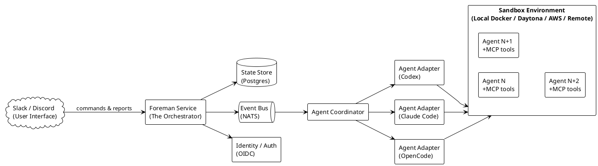

# Foreman Architecture

## Table of Contents

1. [Executive Summary](#1-executive-summary)
2. [Architecture Overview](#2-architecture-overview)
3. [Component Deep Dive](#3-component-deep-dive)
4. [Reliability & Recovery](#4-reliability--recovery)
5. [Identity & Security](#5-identity--security)
6. [Agent Abstraction Layer](#6-agent-abstraction-layer)
7. [MCP Hub & Tool Registry](#7-mcp-hub--tool-registry)
8. [Sandbox Architecture](#8-sandbox-architecture)

---

## 1. Executive Summary

Foreman is an event-driven service that lives in Slack or Discord, receives tasks in natural language, and orchestrates coding agents to execute them with reliable state management, approval gates, and audit trails.

---

## 2. Architecture Overview

### 2.1 System Context

See `docs/diagrams/system-context.puml` for the component architecture.



> Source: `docs/diagrams/system-context.puml`

### 2.2 Architecture Principles

1. **Reliability first.** Every component has defined failure modes, retry policies, and recovery paths. The system is designed for crash recovery, not crash avoidance.
2. **Pluggable agents.** No hard dependency on any single agent framework. The adapter layer makes agents interchangeable.
3. **Identity-bound.** Every action is attributed to a user identity. Agent tokens are scoped to the minimal surface needed.
4. **Approval-gated.** Destructive actions (push, deploy, merge) require human approval by default. The policy engine controls what needs approval.
5. **Asynchronous by default.** Task submission returns immediately with a session ID. All reporting happens via events, not blocking RPC.
6. **Sandboxed execution.** Agents never run on the Foreman host. They execute in isolated environments with resource limits.


## 3. Component Deep Dive

### 3.1 Foreman Core Service

The main process. Long-running daemon that hosts all other components as modules or subprocesses.

**Responsibilities:**
- Boots and connects all subsystems
- Exposes the internal API for communication plugins
- Manages graceful shutdown (drain active agents, persist state)
- Health check endpoint for monitoring
- Configuration management (hot-reload where possible)

**Lifecycle:** `docs/diagrams/core-lifecycle.puml`

**Technology:** Go binary, single deployment artifact.

### 3.2 Control Plane

The brain. Manages sessions, state machines, policies, and recovery.

**Responsibilities:**
- Session lifecycle management (create, track, teardown)
- Task state machine (PENDING -> ALLOCATING -> RUNNING -> BLOCKED -> COMPLETED/FAILED/CANCELLED)
- Policy evaluation (does this task need approval? which agent type should handle it?)
- Recovery orchestration (if the Foreman restarts, what was in flight?)
- Rate limiting and concurrency caps
- Audit log generation

**Session State Machine:** `docs/diagrams/session-state-machine.puml`

**Recovery:** On restart, Control Plane loads all non-terminal sessions. ALLOCATING -> fail. RUNNING with recent heartbeat -> reconnect. RUNNING with stale heartbeat -> fail. BLOCKED -> re-send approval. PENDING -> re-queue.

### 3.3 Event Bus

The nervous system. All async communication flows through the event bus.

**Technology:** NATS (lightweight, embedded or clustered). Core NATS for at-most-once events (heartbeats, logs). JetStream for at-least-once delivery when needed (session events, checkpoints).

**Serialization:** JSON over NATS. Standard Go `encoding/json` serialization of typed structs. JSON is chosen over Protobuf for simplicity, debuggability, and because we are Go-only (no cross-language schema management needed). NATS subjects use dot-notation hierarchy for routing.

**NATS Subject Hierarchy:**

```
foreman.session.<action>      -- session lifecycle events
foreman.agent.<action>        -- agent runtime events
foreman.approval.<action>     -- approval flow events
foreman.command.<action>      -- internal commands (Control Plane -> Coordinator)
foreman.plugin.<name>.<event> -- plugin I/O
```

**Event Schemas:**

Every event embeds standard metadata:

```go
type EventMeta struct {
    EventID   string    `json:"event_id"`
    SessionID string    `json:"session_id,omitempty"`
    Source    string    `json:"source"`
    Timestamp time.Time `json:"timestamp"`
}
```

**Session Events** (subject: `foreman.session.<action>`):

| Event | Subject | Schema | Delivery |
|-------|---------|--------|----------|
| Created | `foreman.session.created` | `SessionCreated` | JetStream |
| State change | `foreman.session.state` | `SessionStateChanged` | JetStream |
| Blocked | `foreman.session.blocked` | `SessionBlocked` | JetStream |
| Completed | `foreman.session.completed` | `SessionCompleted` | JetStream |
| Failed | `foreman.session.failed` | `SessionFailed` | JetStream |
| Cancelled | `foreman.session.cancelled` | `SessionCancelled` | JetStream |

```go
type SessionCreated struct {
    Meta    EventMeta `json:"meta"`
    UserID  string    `json:"user_id"`
    Plugin  string    `json:"plugin"`
    Task    string    `json:"task"`
    Channel string    `json:"channel,omitempty"`
}

type SessionStateChanged struct {
    Meta     EventMeta `json:"meta"`
    OldState string    `json:"old_state"`
    NewState string    `json:"new_state"`
    Reason   string    `json:"reason,omitempty"`
}

type SessionBlocked struct {
    Meta    EventMeta `json:"meta"`
    Reason  string    `json:"reason"`
    Policy  string    `json:"policy,omitempty"`
    Summary string    `json:"summary"`
    Diff    string    `json:"diff,omitempty"`
}

type SessionCompleted struct {
    Meta     EventMeta `json:"meta"`
    Result   string    `json:"result"`
    Summary  string    `json:"summary"`
    Duration string    `json:"duration"`
}

type SessionFailed struct {
    Meta    EventMeta `json:"meta"`
    Error   string    `json:"error"`
    Attempt int       `json:"attempt"`
}

type SessionCancelled struct {
    Meta   EventMeta `json:"meta"`
    Reason string    `json:"reason"`
}
```

**Agent Events** (subject: `foreman.agent.<action>`):

| Event | Subject | Schema | Delivery |
|-------|---------|--------|----------|
| Heartbeat | `foreman.agent.heartbeat` | `AgentHeartbeat` | Core NATS |
| Log | `foreman.agent.log` | `AgentLog` | Core NATS |
| Checkpoint | `foreman.agent.checkpoint` | `AgentCheckpoint` | JetStream |
| Crash | `foreman.agent.crash` | `AgentCrash` | JetStream |

```go
type AgentHeartbeat struct {
    Meta         EventMeta `json:"meta"`
    AgentID      string    `json:"agent_id"`
    SandboxID    string    `json:"sandbox_id"`
    CPUUsage     float64   `json:"cpu_usage,omitempty"`
    MemoryUsage  float64   `json:"memory_usage,omitempty"`
}

type AgentLog struct {
    Meta    EventMeta `json:"meta"`
    AgentID string    `json:"agent_id"`
    Stream  string    `json:"stream"` // stdout, stderr
    Line    string    `json:"line"`
}

type AgentCheckpoint struct {
    Meta     EventMeta       `json:"meta"`
    AgentID  string          `json:"agent_id"`
    Snapshot json.RawMessage `json:"snapshot"`
    Step     string          `json:"step,omitempty"`
}

type AgentCrash struct {
    Meta      EventMeta `json:"meta"`
    AgentID   string    `json:"agent_id"`
    Signal    string    `json:"signal,omitempty"`
    ExitCode  int       `json:"exit_code"`
    LogTail   string    `json:"log_tail,omitempty"`
}
```

**Approval Events** (subject: `foreman.approval.<action>`):

| Event | Subject | Schema | Delivery |
|-------|---------|--------|----------|
| Required | `foreman.approval.required` | `ApprovalRequired` | JetStream |
| Granted | `foreman.approval.granted` | `ApprovalResponse` | JetStream |
| Denied | `foreman.approval.denied` | `ApprovalResponse` | JetStream |

```go
type ApprovalRequired struct {
    Meta      EventMeta `json:"meta"`
    Policy    string    `json:"policy"`
    Action    string    `json:"action"`
    Target    string    `json:"target"`
    Summary   string    `json:"summary"`
    Diff      string    `json:"diff,omitempty"`
    Approvers []string  `json:"approvers"`
    Timeout   int       `json:"timeout"` // seconds
}

type ApprovalResponse struct {
    Meta      EventMeta `json:"meta"`
    Approved  bool      `json:"approved"`
    Responder string    `json:"responder"`
    Reason    string    `json:"reason,omitempty"`
}
```

**Internal Commands** (subject: `foreman.command.<action>`):

| Event | Subject | Schema | Delivery |
|-------|---------|--------|----------|
| Allocate | `foreman.command.allocate` | `AllocateCommand` | JetStream |
| Teardown | `foreman.command.teardown` | `TeardownCommand` | JetStream |

```go
type AllocateCommand struct {
    Meta        EventMeta     `json:"meta"`
    AgentType   string        `json:"agent_type"`
    TaskSpec    json.RawMessage `json:"task_spec"`
    SandboxType string        `json:"sandbox_type"`
    Tools       []string      `json:"tools"`
}

type TeardownCommand struct {
    Meta      EventMeta `json:"meta"`
    AgentID   string    `json:"agent_id"`
    Reason    string    `json:"reason"`
    Force     bool      `json:"force"`
}
```

### 3.3.1 Event Bus Implementation

**Stream Configuration:**

Single `foreman-events` stream with `FileStorage` and `LimitsPolicy` retention -- messages kept for 14 days regardless of consumption, enabling replay for crash recovery:

```go
streamConfig := jetstream.StreamConfig{
    Name:     "foreman-events",
    Subjects: []string{
        "foreman.session.>",
        "foreman.agent.>",
        "foreman.approval.>",
        "foreman.command.>",
        "foreman.plugin.>",
    },
    Storage:      jetstream.FileStorage,
    Retention:    jetstream.LimitsPolicy,
    MaxAge:       14 * 24 * time.Hour,
    DuplicatesWindow: 2 * time.Minute,
}
```

**Consumer Pattern -- Pull Consumers (preferred):**

All event processors use pull consumers with explicit acknowledgements. Pull consumers give the application control over fetch rate (built-in backpressure). Durable consumers auto-resume from the last acknowledged message on restart -- no manual recovery logic needed.

```go
consumer, _ := stream.CreateOrUpdateConsumer(ctx, jetstream.ConsumerConfig{
    Durable:       "foreman-session-worker",
    AckPolicy:     jetstream.AckExplicitPolicy,
    DeliverPolicy: jetstream.DeliverAllPolicy,
    MaxAckPending: 100,
    MaxDeliver:    10,
    AckWait:       30 * time.Second,
})
```

**Exactly-Once Delivery (Three Layers):**

1. **Publish deduplication:** Each event carries a unique ID via `Nats-Msg-Id` header; NATS server drops duplicates within a 2-minute window.
2. **Consumer ack policy:** `AckExplicitPolicy` requires every message to be individually acknowledged. Un-acked messages are redelivered (up to `MaxDeliver`).
3. **Idempotent handlers:** Event processors are designed to handle duplicate deliveries safely (check-then-act pattern).

**Crash Recovery:**

- On restart, durable consumers automatically resume from the last acknowledged sequence position
- For full state rebuild, create a temporary consumer with `DeliverByStartTimePolicy` to replay events from a specific point in time
- Core NATS subjects (heartbeats, logs) are at-most-once and lost on crash -- acceptable for transient data

**Deployment:**

- **Development/testing:** Embedded NATS server running in-process with the Foreman binary. Single binary deployment, zero external dependencies.
- **Production:** Separate NATS server cluster (3 nodes minimum), JetStream enabled, file-based storage with replication factor 3.
- **Monitoring:** Prometheus NATS exporter + Grafana dashboard; key metric is `jetstream_consumer_ack_pending` for slow consumer detection.

```go
// Embedded NATS for development
import "github.com/nats-io/nats-server/v2/server"

opts := &server.Options{
    Port:           -1,           // random port
    JetStream:      true,
    JetStreamMaxStore: 10 * 1024 * 1024 * 1024,
}
ns, err := server.NewServer(opts)
go ns.Start()
nc, err := nats.Connect(ns.ClientURL())
```

### 3.4 State Store

The memory. All durable state lives here.

**Schema domains:**
- **Sessions:** id, user_id, plugin_id, task_payload, state, created_at, updated_at, checkpoint_ref
- **Tasks:** id, session_id, agent_type, status, result, error, attempts, max_retries
- **Checkpoints:** id, session_id, snapshot (JSON blob), created_at
- **Audit Log:** id, session_id, user_id, action, target, timestamp, metadata
- **Identity Bindings:** agent_token, session_id, scope, expires_at, user_id
- **Policies:** rule_id, condition, action, priority

**Technology:** PostgreSQL (single source of truth). Redis optional for cache/rate-limiting.

### 3.5 Agent Coordinator

The hands. Spawns, monitors, and tears down agent instances.

**Responsibilities:**
- Receives task assignments from the Control Plane (via Event Bus)
- Selects the appropriate sandbox type (local Docker, Daytona workspace, cloud VM)
- Calls the relevant Agent Adapter to build the agent environment
- Monitors agent liveness via heartbeats
- Collects and forwards logs and checkpoints
- Handles graceful and forceful agent termination
- Enforces resource limits (CPU, memory, disk, time)

**Spawn flow:**
```
1. Receive allocate command (with task spec + agent type)
2. Provision sandbox (container/workspace/VM)
3. Configure MCP tools for this task
4. Generate scoped identity token for agent
5. Call Adapter to start agent within sandbox
6. Subscribe to agent heartbeat stream
7. Report session.running to Control Plane
8. Monitor until completion or failure
```

### 3.6 Agent Adapter Plugin

The translator. Each supported agent framework gets an adapter that implements a common interface.

**Adapter Interface:** See [Section 6.2](#62-adapter-interface-detailed) for the full canonical `AgentAdapter` interface definition. It covers metadata, lifecycle (BuildConfig, Verify, StartCommand), communication (ParseEvent, InjectPrompt), and health (HeartbeatTimeout, CheckHealth).

**Adapters to build:**
- **OpenCode adapter** - connects to opencode, feeds MCP tools, parses structured output
- **Claude Code adapter** - wraps Claude Code CLI, manages its session loop
- **Codex adapter** - OpenAI Codex integration
- **OpenHands adapter** - for complex multi-step tasks
- **Generic adapter** - Dockerfile-based: user provides a container image with their agent

### 3.7 Communication Plugins

The face of the system in the team's chat.

**Plugin Interface:**

Each communication platform implements this interface to connect to Foreman:

```go
type Plugin interface {
    // Identity
    Name() string
    Version() string

    // Lifecycle
    Start(ctx context.Context, bus EventBus) error
    Stop(ctx context.Context) error

    // Outbound messages
    SendMessage(ctx context.Context, channel string, msg Message) error
    SendBlockMessage(ctx context.Context, channel string, blocks []Block) error
}
```

Each plugin publishes `UserMessage` events via the Event Bus on subject `foreman.plugin.<name>.message` for the Control Plane to consume:

```go
type UserMessage struct {
    Meta      EventMeta `json:"meta"`
    Plugin    string    `json:"plugin"`     // "slack", "discord"
    UserID    string    `json:"user_id"`
    Channel   string    `json:"channel"`
    Text      string    `json:"text"`
    ThreadTS  string    `json:"thread_ts,omitempty"`
    Raw       []byte    `json:"raw,omitempty"` // platform-specific original payload
}
```

**Responsibilities:**
- Receive natural language input from users
- Parse commands and context
- Publish UserMessage to Event Bus for Control Plane
- Subscribe to session events and report progress, approvals, results
- Support interactive patterns (thread replies, modals, buttons)

**Slack Plugin:**
- Slash commands (`/foreman review this PR`)
- App mentions (`@Foreman deploy the staging branch`)
- Interactive components (approve/deny buttons)
- Thread replies for long-running task updates
- Uses Slack Socket Mode (no public endpoint needed)

**Discord Plugin:**
- Slash commands
- Thread updates
- Role-based access control

### 3.8 Approval Gate

The safety mechanism. Critical path before production-impacting actions.

**How it works:**
1. Agent completes a task that crosses a policy threshold (e.g., "creates a PR", "modifies main branch", "runs deployment")
2. Agent reports completion with a diff/plan
3. Control Plane evaluates policy -> computes `approval.required`
4. Approval event sent to communication plugin with summary + diff/plan
5. Plugin renders in channel with Approve / Deny / Request Changes buttons
6. User response published back as `approval.granted` or `approval.denied`
7. On approval: Control Plane tells Coordinator to proceed with the action
8. On denial: session moves to CANCELLED with reason recorded

**Policy configuration:**
```yaml
policies:
  - action: "push"
    branch: "main"
    require_approval: true
    approvers: ["team-lead"]
  - action: "push"
    branch: "*"
    require_approval: false
  - action: "deploy"
    environment: "production"
    require_approval: true
    approvers: ["devops"]
    timeout: 300  # auto-deny after 5 minutes
```


## 4. Reliability & Recovery

### 4.1 Crash Domains

Each component fails independently. A crash in one domain should not cascade.

| Component | Failure Mode | Impact | Recovery |
|-----------|-------------|--------|----------|
| Control Plane | Process crash | No new tasks accepted, in-flight sessions orphaned | Recover from State Store on restart |
| Event Bus (NATS) | Connection loss | Tasks cannot be dispatched | Buffered writes + reconnect with exponential backoff |
| State Store (Postgres) | Connection loss | No persistence | Read-only fallback, queue writes, alert operator |
| Agent Coordinator | Crash | Orphaned sandboxes (leak) | Reaper process on restart, heartbeat gap detection |
| Agent Instance | Crash | Task interrupted | Retry from checkpoint (up to N times) |
| Sandbox | OOM / OODisk | Agent killed | Retry with larger resources or fail |
| Communication Plugin | Connection drop | User sees stale UI | Reconnect, re-sync session state on reconnect |

### 4.2 Checkpoint System

Each agent periodically emits checkpoints that capture:
- Current task context (files modified, branch state)
- Completed work steps
- Accumulated logs
- MCP server states

**Checkpoint frequency:** Default every 30s or every completed sub-step, configurable.

**Storage:** PostgreSQL JSONB blob (compressed for large checkpoints).

**Restore:** On recovery, the new agent receives the last checkpoint and replays from that state. Idempotency is the agent's responsibility (the checkpoints are best-effort snapshots).

### 4.3 Graceful Shutdown

On SIGTERM:
1. Control Plane stops accepting new tasks
2. Drain in-flight tasks:
   - For RUNNING agents: send "prepare to checkpoint" signal, wait N seconds
   - For BLOCKED agents: persist the pending approval state
3. Final checkpoint for all active sessions
4. Close Event Bus subscriptions
5. Flush State Store writes
6. Exit

Timeout: 30s total. After that, heavy SIGKILL.

---

## 5. Identity & Security

### 5.1 Identity Model

Every entity in the system has an identity:

| Entity | Identity Type | Issued By | Scope |
|--------|--------------|-----------|-------|
| Human User | Slack/Discord user ID | Communication Plugin | Natural language commands |
| Foreman Service | OIDC client ID | Configuration | Internal API access |
| Agent Instance | Scoped OAuth2 token | Identity Provider | Specific repo + branch + actions |
| Foreman Admin | API key | Configuration | Management API |

### 5.2 Agent Token Scoping

When an agent is spawned, it receives a time-limited token scoped to exactly what it needs:

```json
{
  "sub": "agent-<session-uuid>",
  "iss": "foreman",
  "aud": ["github"],
  "iat": <issue_time>,
  "exp": <expiry_time>,
  "scope": {
    "repos": ["org/repo"],
    "actions": ["read", "pull", "push"],
    "branches": ["feature/*"],
    "max_prs": 3,
    "no_delete": true
  }
}
```

The GitHub App or GitLab App associated with Foreman validates this scope before allowing any action.

### 5.3 Audit Trail

Every action is logged:
- Who requested the task (user identity)
- Which agent was selected (and why)
- Every command the agent executed
- Every checkpoint captured
- Every approval/denial event
- Every failure and retry

Audit logs are immutable (append-only in the State Store) and retained per organizational policy.

### 5.4 Sandbox Security

- Agents never have network access to the Foreman host
- Network egress limited to: git remote, MCP servers, Foreman API
- No internet access by default (configurable for package downloads)
- File system is ephemeral and destroyed on teardown
- Secrets injected via environment variables, never written to disk
- Resource limits (CPU/memory/disk/process count) enforced by Docker/cgroups

---

## 6. Agent Abstraction Layer

### 6.1 Why an Abstraction Layer

Different agent frameworks have:
- Different CLI interfaces (flags, stdin protocols, output formats)
- Different capability sets (file editing, web browsing, tool calling)
- Different session models (stateless vs. persistent loops)
- Different hardware requirements (some need GPUs, some don't)

The adapter layer normalizes these differences so the Control Plane does not need to know which agent it is talking to.

### 6.2 Adapter Interface (Detailed)

```go
type AgentAdapter interface {
    // Metadata
    Name() string
    Version() string
    Capabilities() []Capability

    // Lifecycle
    // BuildConfig produces the configuration for launching this agent
    BuildConfig(spec TaskSpec, tools []ToolBinding) (AgentConfig, error)
    // Verify checks that the agent runtime is present in the sandbox
    Verify(ctx context.Context, sandbox Sandbox) error
    // StartCommand returns the command vector to launch the agent
    StartCommand(config AgentConfig) []string
    // StartEnv returns additional environment variables for the agent
    StartEnv(config AgentConfig) map[string]string

    // Communication
    // ParseEvent translates one line/unit of agent output into a structured event
    ParseEvent(line string) (*AgentEvent, error)
    // InjectPrompt injects instructions/prompts into the agent's context
    InjectPrompt(ctx context.Context, sandbox Sandbox, prompt string) error

    // Health
    // HeartbeatTimeout returns the expected max interval between heartbeats
    HeartbeatTimeout() time.Duration
    // CheckHealth performs a liveness check on the agent
    CheckHealth(ctx context.Context, sandbox Sandbox) error
}
```

### 6.3 Agent Capability Model

Each agent declares what it can do:

```go
type Capability string

const (
    CapFileRead      Capability = "file.read"
    CapFileWrite     Capability = "file.write"
    CapGitRead       Capability = "git.read"
    CapGitWrite      Capability = "git.write"
    CapTestRun       Capability = "test.run"
    CapWebSearch     Capability = "web.search"
    CapWebFetch      Capability = "web.fetch"
    CapTerminalExec  Capability = "terminal.exec"
    CapPRCreate      Capability = "pr.create"
    CapReview        Capability = "code.review"
    CapDeploy        Capability = "deploy"
)
```

The Control Plane uses this to match tasks to agents: if a task requires `pr.create` and the agent doesn't support it, the system either selects a different agent or rejects the task early.

### 6.4 Example: Claude Code Adapter

Claude Code runs as a subprocess. The adapter:

1. Verifies `claude` binary is in the sandbox PATH
2. Sets environment variables (`ANTHROPIC_API_KEY`, `CLAUDE_CODE_CONFIG`)
3. Launches Claude in headless mode:

```bash
claude --bare -p "<task>" \
  --output-format json \
  --allowedTools "Read,Edit,Bash(git *),Bash(npm *),Bash(go *),Grep" \
  --max-turns 40 \
  --max-budget-usd 2 \
  --permission-mode bypassPermissions
```

4. Parses JSON output: reads `.result` for answer text, `.session_id` for continuation, `.total_cost_usd` for cost tracking
5. Exit code 0 = success; non-zero = failure (check stderr for details). Always parse JSON output rather than relying on exit codes alone.
6. For multi-turn sessions: capture session ID from JSON output, then call with `--resume <session_id>`
7. Claude's built-in MCP support is used directly, with tools scoped via `--allowedTools`

**Important:** `--permission-mode bypassPermissions` requires a one-time interactive acceptance on first run. Set `skipDangerousModePermissionPrompt: true` in `~/.claude/settings.json` for fully unattended operation. In sandboxed environments this is safe -- the flag name is deliberately alarming.

**Alternative SDK path:** Anthropic also publishes Agent SDKs (`anthropic-agent-sdk` for Python, `@anthropic-ai/claude-agent-sdk` for TypeScript) that wrap the same CLI as a subprocess internally, providing higher-level programmatic APIs.

### 6.5 Example: OpenCode Adapter

OpenCode can be driven in two ways:

**Path A -- Server Mode (Preferred):**

Start `opencode serve --port 4096` as a background process (HTTP API):
- `POST /session` -- create a new session
- `POST /session/:id/message` -- submit a message/task
- `GET /event` -- SSE stream for session events
- `POST /session/:id/abort` -- cancel a running session

This is the most reliable approach for persistent, multi-turn agent sessions.

**Path B -- Run Mode (One-shot tasks):**

```bash
opencode run --format json --model anthropic/claude-sonnet-4-5 \
  --agent build "Implement the login feature"
```

Output is newline-delimited JSON (JSONL) on stdout with five event types:

| Event | When | Key Fields |
|-------|------|-----------|
| `step_start` | Processing begins | `sessionID` |
| `tool_use` | Tool completes | `part.tool`, `part.state.output` |
| `text` | Model text output | `part.text` |
| `step_finish` | Step ends | `part.reason` (stop/tool-calls), `part.cost` |
| `error` | Session error | `error.name`, `error.data.message` |

**Critical Caveats:**
- Permission system has hard-coded defaults. Built-in agents include deny/ask rules (e.g., `external_directory: ask`) that require TUI interaction even with `--auto`.
- Exit codes are unreliable (often 0 even on failure). Always parse the JSONL stream for `error` events or wait for `step_finish` with `reason: stop`.
- Session permission presets are set at bootstrap with `question: deny`, `plan_enter: deny`, `plan_exit: deny` and cannot be overridden via config.
- The server mode (Path A) provides more control by working around permission limitations through the HTTP API.

---

## 7. MCP Hub & Tool Registry

### 7.1 Purpose

The Model Context Protocol is how agents get access to tools (git, filesystem, search, etc.). The MCP Hub manages which tools are available and binds them to agents at spawn time.

### 7.2 Tool Registry

Static registry of available MCP servers:

```yaml
mcp_servers:
  - name: "filesystem"
    command: "npx"
    args: ["-y", "@modelcontextprotocol/server-filesystem"]
    allowed_paths: ["/workspace"]
    capabilities: [CapFileRead, CapFileWrite]

  - name: "github"
    command: "npx"
    args: ["-y", "@modelcontextprotocol/server-github"]
    auth_method: "token"
    capabilities: [CapGitRead, CapGitWrite, CapPRCreate]

  - name: "test-runner"
    command: "npx"
    args: ["-y", "@modelcontextprotocol/server-shell"]
    allowed_commands: ["npm test", "pnpm test", "cargo test", "go test", "pytest"]
    capabilities: [CapTestRun]
```

### 7.3 Dynamic Binding

When an agent is spawned:
1. Control Plane determines required capabilities from the task spec
2. MCP Hub selects the subset of servers that provide those capabilities
3. Coordinator provisions the sandbox with those MCP servers running alongside the agent
4. Agent discovers the MCP servers via the MCP protocol (stdio or SSE)

### 7.4 MCP Server Lifecycle

Managed by the Agent Coordinator within each sandbox:
- **Start:** Before the agent launches, start the required MCP servers
- **Bind:** Configure the agent to connect to them (via stdio sockets or SSE endpoints)
- **Monitor:** Track MCP server health alongside the agent
- **Stop:** On sandbox teardown, gracefully shut down all MCP servers
- **Log:** Capture MCP server logs for debugging

### 7.5 Protocol Version Support

MCP has two active protocol versions. The Hub must support both:

**Legacy (2025-11-25) -- Session-based:**
- Requires `initialize` handshake before operation: exchange protocol versions, capabilities, client/server info
- Client sends `notifications/initialized` to complete handshake
- Session state maintained over transport connection
- Transport: stdio subprocess or HTTP+SSE

**Modern (2026-07-28) -- Stateless:**
- No handshake required; each request is self-contained
- Protocol version and capabilities carried in `_meta` field on every request
- Optional `server/discover` RPC for capability probing
- Cancellation: close SSE response stream (HTTP) or `notifications/cancelled` (stdio)
- Transport: stdio subprocess or Streamable HTTP (single endpoint, POST only)

**Go SDKs:**

| SDK | Version | Maturity | Protocol | Use For |
|-----|---------|----------|----------|---------|
| `mark3labs/mcp-go` | v0.31+ | 2500+ stars, MIT | 2025-11-25 | Initial Hub implementation |
| `modelcontextprotocol/go-sdk` | v1.1+ | Official (Google) | 2026-07-28 | Modern protocol upgrade path |

**Hub strategy -- version detection:**

```
Probe with server/discover ------> Modern (2026-07-28)
  |                                  
  +--> MethodNotFound / UnsupportedProtocolVersionError
       |
       +--> Fall back to initialize handshake --> Legacy (2025-11-25)
```

Cache the detected era per server endpoint.

**Transport handling:**

- **stdio (sandbox-managed servers):** Hub spawns the MCP server as a subprocess inside the sandbox, writes JSON-RPC to stdin, reads responses from stdout. Server logs go to stderr. On teardown: close stdin, SIGTERM, SIGKILL if needed.
- **Streamable HTTP (external servers):** Each request is an HTTP POST to the server's endpoint. For external servers, the Hub manages OAuth 2.1 with PKCE authentication and token refresh.

---

## 8. Sandbox Architecture

### 8.1 Sandbox Abstraction

The sandbox is where agents execute. It must be isolated, disposable, and resource-constrained.

```go
type Sandbox interface {
    Provision(ctx context.Context, spec SandboxSpec) error
    Execute(ctx context.Context, cmd []string, env map[string]string) (*ExecutionResult, error)
    WriteFile(ctx context.Context, path string, content []byte) error
    ReadFile(ctx context.Context, path string) ([]byte, error)
    UploadCheckpoint(ctx context.Context, data []byte) error
    SubscribeEvents(ctx context.Context) (<-chan SandboxEvent, error)
    Heartbeat() (SandboxStatus, error)
    Destroy(ctx context.Context) error
}
```

**Vendor lock-in decision:** We do NOT use third-party sandbox platforms (Daytona, Modal, E2B, Northflank) that charge per-use and create vendor dependency. Instead, we self-host using open-source isolation technology. The Sandbox interface is designed to abstract the provider -- switching from Docker to gVisor to Kata requires only a new implementation.

**Isolation tiers (self-hosted, open source):**

- **Tier 1 (Production, multi-tenant):** Kata Containers with Firecracker backend. Hardware-level VM isolation via KVM. OCI-compatible -- same `docker run` workflow with `--runtime=kata`. Open source (OpenInfra Foundation), no vendor lock-in. ~200ms cold start, full syscall compatibility.
- **Tier 2 (Production, single-tenant):** Docker + gVisor (runsc). Userspace kernel intercepts syscalls. ~1-10ms cold start, ~200 syscalls implemented. Simpler to operate than Kata but shares host kernel.
- **Tier 3 (Development):** Plain Docker (runc). Shared kernel, sufficient for single-user dev. Zero additional setup.

### 8.2 Sandbox Types

| Technology | Isolation | Cold Start | Memory Overhead | Syscall Compat | OCI Compat | Ops Complexity | Use Case |
|-----------|-----------|-----------|----------------|---------------|-----------|---------------|----------|
| **Docker (runc)** | Shared kernel (namespace) | <100ms | Negligible | Full | Native | Low | Dev, single-user |
| **gVisor (runsc)** | Userspace kernel | 1-10ms | 10-50MB | ~200 syscalls | Native | Low | Single-tenant production |
| **Kata + Firecracker** | Hardware VM (KVM) | 150-300ms | 50-150MB | Full (real kernel) | Native | Medium | Multi-tenant production |
| **Pure Firecracker** | Hardware VM (KVM) | 100-300ms | 5-10MB + guest kernel | Full (real kernel) | Not native | High | Max density/scale |

**Not recommended:** Building your own sandbox using Linux namespaces + cgroups + seccomp. Shared-kernel isolation (namespaces) is not a security boundary for untrusted agent code. Maintaining seccomp profiles is extremely tedious and breakage is silent. If you need more than Docker, use gVisor or Kata.

### 8.3 Resource Limits

```yaml
sandbox_defaults:
  cpu: "2"
  memory: "4Gi"
  disk: "10Gi"
  network: "isolated"  # isolated, outbound-only, full
  timeout: "30m"        # max agent runtime

sandbox_overrides:
  - task_type: "code_review"
    cpu: "1"
    memory: "2Gi"
    timeout: "10m"
  - task_type: "deploy"
    timeout: "5m"
    network: "outbound-only"
```

### 8.4 Workspace Layout

```
/workspace/
  repo/                  # cloned repository
    .git/
    src/
    ...
  .foreman/
    config.yaml          # agent-specific config
    checkpoint.json      # latest checkpoint
    logs/                # agent output logs
      agent.log
      mcp-filesystem.log
      mcp-github.log
  .mcp-servers/          # MCP server sockets/configs
    filesystem.sock
    github.sock
```

---

## Appendix A: Technology Decisions

| Component | Choice | Rationale |
|-----------|--------|-----------|
| Core language | Go | Single binary, excellent concurrency (goroutines per session), strong standard library, good Docker support |
| State Store | PostgreSQL | Reliable, well-understood, JSONB for checkpoints, good tooling |
| Event Bus | NATS | Lightweight, embedded mode for small deployments, clustered for scale, simple protocol |
| Sandbox (dev) | Docker (runc) | Zero setup, instant start, shared kernel -- sufficient for single-user |
| Sandbox (single-tenant prod) | Docker + gVisor (runsc) | Open source, userspace kernel isolation, ~1-10ms cold start |
| Sandbox (multi-tenant prod) | Kata Containers + Firecracker | Open source, hardware VM isolation via KVM, OCI-compatible, no vendor lock-in |
| Sandbox (max density) | Pure Firecracker via Go SDK | Full control at highest ops cost -- only at scale |
| Communication | Slack SDK + Discord SDK | Official SDKs, well-maintained, interactive component support |
| Identity | OIDC + GitHub/GitLab Apps | Standard protocol, scoped tokens, well-supported |
| MCP servers | npm packages + custom | Growing ecosystem of open-source MCP servers |
| Configuration | YAML + env vars | Familiar, hierarchical, easy to version-control |

## Appendix B: Key Design Decisions

1. **Why NATS over RabbitMQ/Kafka?** Lighter weight, simpler to deploy (embedded mode), sufficient throughput for our use case (hundreds to low thousands of events per second). Kafka is overkill until we need log compaction or multi-region replication.

2. **Why PostgreSQL over a document store?** The session/task data is relational by nature. JSONB gives us document flexibility for checkpoint data. One database to operate instead of two.

3. **Why not run agents on the Foreman host?** Security isolation, resource containment, and independent lifecycle management. Agents are untrusted code (they run arbitrary terminal commands). They should never share a process space with the orchestrator.

4. **Why checkpoint-based recovery instead of hot failover?** Simpler to implement correctly. Hot failover requires consensus, leader election, and state replication. Checkpoint recovery is "fail fast, retry from last known good state" -- good enough for a developer tool and far more reliable in practice.

5. **Why no vendor-locked sandbox platforms?** Platforms like Daytona, Modal, and E2B provide excellent isolation but charge per-use and create vendor dependency. By using open-source isolation layers (gVisor, Kata Containers + Firecracker) that are OCI-compatible, we can run the same sandbox infrastructure anywhere -- developer laptop, bare metal, or cloud VM. The Sandbox interface abstracts the provider, so the decision can be revisited without code changes.

---

*This is a living document. As we build and learn, the architecture will evolve. The first principle remains: reliability over features.*
