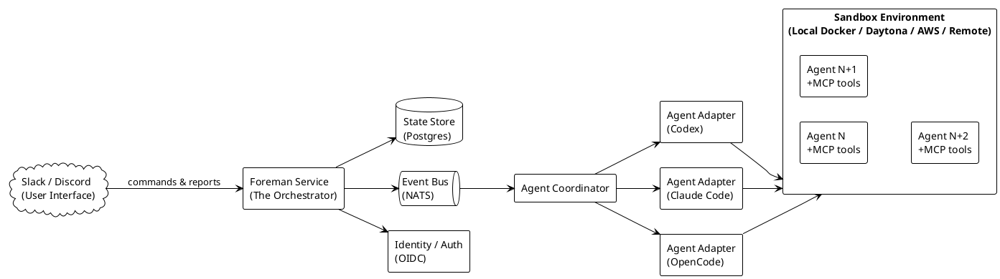
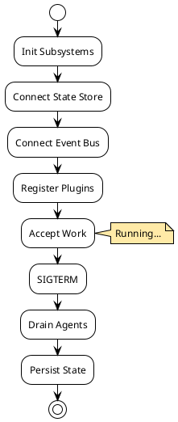
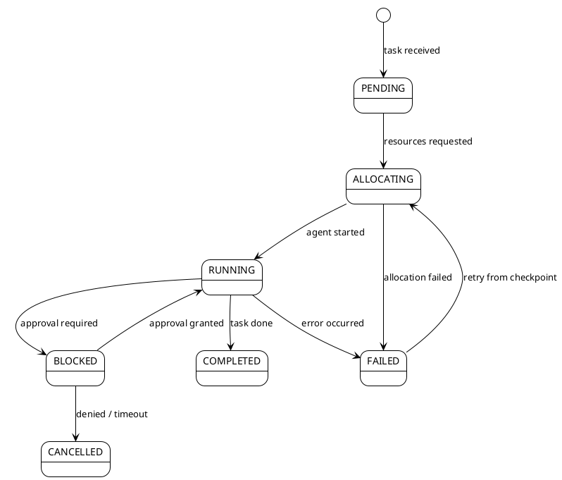
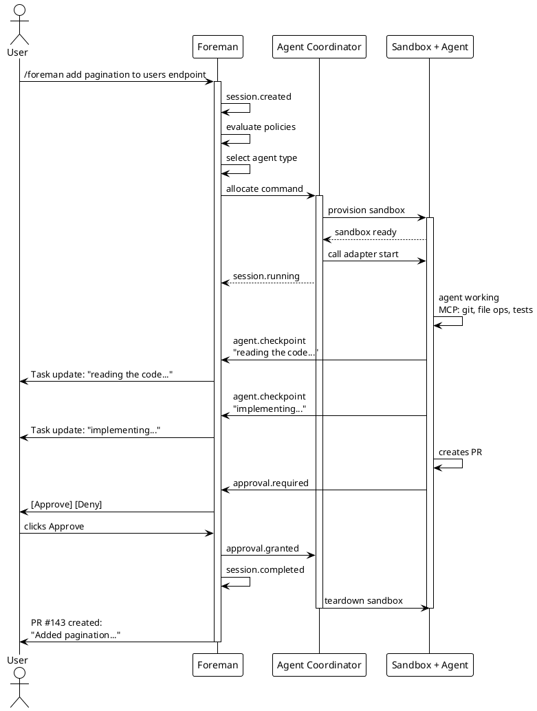
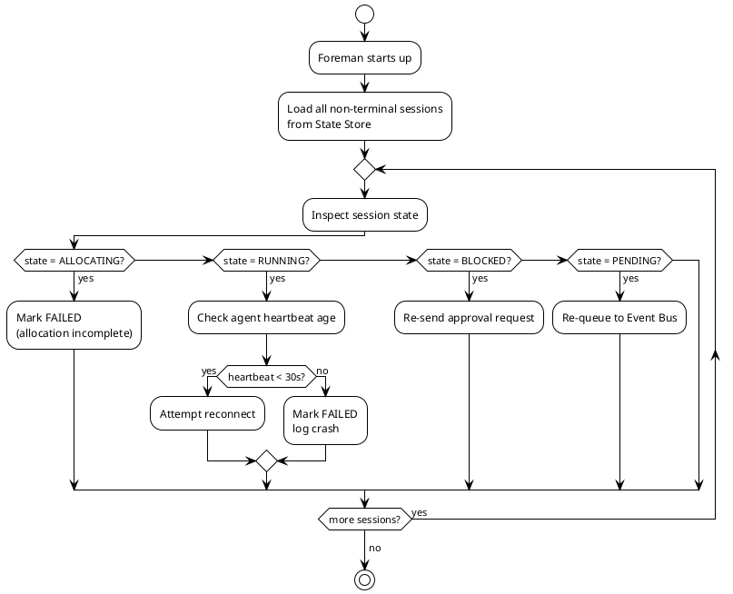
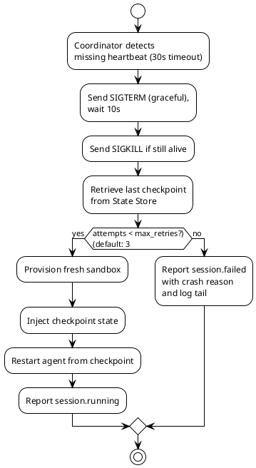

# Foreman Architecture

## Table of Contents

1. [Executive Summary](#1-executive-summary)
2. [Architecture Overview](#2-architecture-overview)
3. [Component Deep Dive](#3-component-deep-dive)
4. [Data Flow: End-to-End](#4-data-flow-end-to-end)
5. [Reliability & Recovery](#5-reliability--recovery)
6. [Identity & Security](#6-identity--security)
7. [Agent Abstraction Layer](#7-agent-abstraction-layer)
8. [MCP Hub & Tool Registry](#8-mcp-hub--tool-registry)
9. [Sandbox Architecture](#9-sandbox-architecture)
10. [Implementation Roadmap](#10-implementation-roadmap)

---

## 1. Executive Summary

Foreman is a chat-native coding agent foreman -- a service that lives in your team's Slack or Discord, receives task requests in natural language, and orchestrates a fleet of specialized coding agents to execute them. It is not another AI coding agent. It is the conductor that coordinates agents across codebases, environments, and frameworks with reliable state management, approval gates, and full audit trails.

**Core thesis:** The building blocks for AI-assisted development exist (coding agents, MCP tools, sandbox runtimes), but no product combines them into a reliable, team-oriented orchestration layer that is present in chat and ready to use. Foreman fills that gap.

**Primary value:** Teams stop managing individual AI tool subscriptions and agent configurations. They talk to Foreman, which picks the right agent, provisions the environment, tracks every action, and reports back -- all within the team's existing chat.

---

## 2. Architecture Overview

### 2.1 System Context



> Source: `docs/diagrams/system-context.puml`

### 2.2 Architecture Principles

1. **Reliability first.** Every component has defined failure modes, retry policies, and recovery paths. The system is designed for crash recovery, not crash avoidance.
2. **Pluggable agents.** No hard dependency on any single agent framework. The adapter layer makes agents interchangeable.
3. **Identity-bound.** Every action is attributed to a user identity. Agent tokens are scoped to the minimal surface needed.
4. **Approval-gated.** Destructive actions (push, deploy, merge) require human approval by default. The policy engine controls what needs approval.
5. **Asynchronous by default.** Task submission returns immediately with a session ID. All reporting happens via events, not blocking RPC.
6. **Sandboxed execution.** Agents never run on the Foreman host. They execute in isolated environments with resource limits.

### 2.3 Key Changes from Initial Topology

The initial diagram had the right bones. Here are the refinements made after analysis:

| Change | Rationale |
|--------|-----------|
| **Merged Runtime Environment + Agent Runtime** into unified Runtime Layer | The split between "cloud provider" and "app runtime" was fuzzy and introduced unnecessary indirection. The Foreman service runs as a single process; the infrastructure provisioning is a sub-concern of the Sandbox system. |
| **Added Event Bus** | Direct control plane-to-coordinator communication does not scale and prevents reliable recovery. NATS provides queuing, retries, and pub/sub for async task flow. |
| **Added State Store** | Sessions, tasks, checkpoints, and agent state need durable persistence. Recovery is impossible without it. |
| **Added Identity Provider** | The user's own content framework centers on IAM Meets AI. Every spawned agent needs a scoped, auditable identity. Missing this would be a fatal gap. |
| **Added Approval Gate** | Teams will not trust a system that pushes code without human review. The gate must be explicit in the architecture. |
| **Added MCP Hub** | MCP servers are the tool ecosystem. A registry and lifecycle manager is needed so agents get the right tools without hard-coding. |

---

## 3. Component Deep Dive

### 3.1 Foreman Core Service

The main process. Long-running daemon that hosts all other components as modules or subprocesses.

**Responsibilities:**
- Boots and connects all subsystems
- Exposes the internal API for communication plugins
- Manages graceful shutdown (drain active agents, persist state)
- Health check endpoint for monitoring
- Configuration management (hot-reload where possible)

**Lifecycle:**


> Source: `docs/diagrams/core-lifecycle.puml`

**Technology:** Go binary, single deployment artifact.

### 3.2 Control Plane

The brain. Manages sessions, state machines, policies, and recovery.

**Responsibilities:**
- Session lifecycle management (create, track, teardown)
- Task state machine (PENDING -> ALLOCATING -> RUNNING -> BLOCKED -> COMPLETED/FAILED/CANCELLED)
- Policy evaluation (does this task need approval? which agent type should handle it?)
- Recovery orchestration (if the Foreman restarts, what was in flight?)
- Rate limiting and concurrency caps
- Audit log generation

**Session State Machine:**



> Source: `docs/diagrams/session-state-machine.puml`

**Recovery state:** When Foreman restarts, the Control Plane loads all non-terminal sessions from the State Store and either resumes or fails them based on their current state and staleness.

### 3.3 Event Bus

The nervous system. All async communication flows through the event bus.

**Events (not exhaustive):**
- `session.created` - new task received
- `session.allocating` - resources being provisioned
- `session.running` - agent started work
- `session.blocked` - waiting for input/approval
- `session.completed` - task finished
- `session.failed` - task errored
- `session.cancelled` - user or policy cancelled
- `agent.heartbeat` - periodic liveness
- `agent.log` - streaming log output
- `agent.checkpoint` - state snapshot for recovery
- `agent.crash` - agent process terminated unexpectedly
- `infra.resource_exhausted` - out of memory/disk
- `approval.required` - gate triggered
- `approval.granted` - user approved
- `approval.denied` - user rejected

**Technology:** NATS (lightweight, embedded or clustered, exactly the scale we need).

### 3.4 State Store

The memory. All durable state lives here.

**Schema domains:**
- **Sessions:** id, user_id, plugin_id, task_payload, state, created_at, updated_at, checkpoint_ref
- **Tasks:** id, session_id, agent_type, status, result, error, attempts, max_retries
- **Checkpoints:** id, session_id, snapshot (JSON blob), created_at
- **Audit Log:** id, session_id, user_id, action, target, timestamp, metadata
- **Identity Bindings:** agent_token, session_id, scope, expires_at, user_id
- **Policies:** rule_id, condition, action, priority

**Technology:** PostgreSQL (single source of truth). Redis optional for cache/rate-limiting.

### 3.5 Agent Coordinator

The hands. Spawns, monitors, and tears down agent instances.

**Responsibilities:**
- Receives task assignments from the Control Plane (via Event Bus)
- Selects the appropriate sandbox type (local Docker, Daytona workspace, cloud VM)
- Calls the relevant Agent Adapter to build the agent environment
- Monitors agent liveness via heartbeats
- Collects and forwards logs and checkpoints
- Handles graceful and forceful agent termination
- Enforces resource limits (CPU, memory, disk, time)

**Spawn flow:**
```
1. Receive allocate command (with task spec + agent type)
2. Provision sandbox (container/workspace/VM)
3. Configure MCP tools for this task
4. Generate scoped identity token for agent
5. Call Adapter to start agent within sandbox
6. Subscribe to agent heartbeat stream
7. Report session.running to Control Plane
8. Monitor until completion or failure
```

### 3.6 Agent Adapter Plugin

The translator. Each supported agent framework gets an adapter that implements a common interface.

**Adapter Interface:**

```go
type AgentAdapter interface {
    // Name returns the agent identifier (e.g., "claude-code", "codex")
    Name() string

    // BuildConfig generates the runtime configuration for this agent
    BuildConfig(task TaskSpec, tools []MCPTool) (AgentConfig, error)

    // Verify checks if the agent runtime is available in the sandbox
    Verify(sandbox Sandbox) error

    // StartCommand returns the command to launch the agent
    StartCommand(config AgentConfig) []string

    // ParseOutput translates agent output into structured events
    ParseOutput(line string) (*AgentEvent, error)

    // Supports reports whether this adapter handles the given task
    Supports(task TaskSpec) bool
}
```

**Adapters to build:**
- **OpenCode adapter** - connects to opencode, feeds MCP tools, parses structured output
- **Claude Code adapter** - wraps Claude Code CLI, manages its session loop
- **Codex adapter** - OpenAI Codex integration
- **OpenHands adapter** - for complex multi-step tasks
- **Generic adapter** - Dockerfile-based: user provides a container image with their agent

### 3.7 Communication Plugins

The face of the system in the team's chat.

**Responsibilities:**
- Receive natural language input from users
- Parse commands and context
- Forward structured tasks to the Control Plane
- Report progress, approvals, and results back to channels
- Support interactive patterns (thread replies, modals, buttons)

**Slack Plugin:**
- Slash commands (`/foreman review this PR`)
- App mentions (`@Foreman deploy the staging branch`)
- Interactive components (approve/deny buttons)
- Thread replies for long-running task updates

**Discord Plugin:**
- Slash commands
- Thread updates
- Role-based access control

### 3.8 Approval Gate

The safety mechanism. Critical path before production-impacting actions.

**How it works:**
1. Agent completes a task that crosses a policy threshold (e.g., "creates a PR", "modifies main branch", "runs deployment")
2. Agent reports completion with a diff/plan
3. Control Plane evaluates policy -> computes `approval.required`
4. Approval event sent to communication plugin with summary + diff/plan
5. Plugin renders in channel with Approve / Deny / Request Changes buttons
6. User response published back as `approval.granted` or `approval.denied`
7. On approval: Control Plane tells Coordinator to proceed with the action
8. On denial: session moves to CANCELLED with reason recorded

**Policy configuration:**
```yaml
policies:
  - action: "push"
    branch: "main"
    require_approval: true
    approvers: ["team-lead"]
  - action: "push"
    branch: "*"
    require_approval: false
  - action: "deploy"
    environment: "production"
    require_approval: true
    approvers: ["devops"]
    timeout: 300  # auto-deny after 5 minutes
```

---

## 4. Data Flow: End-to-End

### 4.1 Typical Task Flow



> Source: `docs/diagrams/typical-task-flow.puml`

### 4.2 Recovery Flow (Foreman Restart)



> Source: `docs/diagrams/recovery-foreman-restart.puml`

### 4.3 Agent Crash Recovery



> Source: `docs/diagrams/agent-crash-recovery.puml`

---

## 5. Reliability & Recovery

### 5.1 Crash Domains

Each component fails independently. A crash in one domain should not cascade.

| Component | Failure Mode | Impact | Recovery |
|-----------|-------------|--------|----------|
| Control Plane | Process crash | No new tasks accepted, in-flight sessions orphaned | Recover from State Store on restart |
| Event Bus (NATS) | Connection loss | Tasks cannot be dispatched | Buffered writes + reconnect with exponential backoff |
| State Store (Postgres) | Connection loss | No persistence | Read-only fallback, queue writes, alert operator |
| Agent Coordinator | Crash | Orphaned sandboxes (leak) | Reaper process on restart, heartbeat gap detection |
| Agent Instance | Crash | Task interrupted | Retry from checkpoint (up to N times) |
| Sandbox | OOM / OODisk | Agent killed | Retry with larger resources or fail |
| Communication Plugin | Connection drop | User sees stale UI | Reconnect, re-sync session state on reconnect |

### 5.2 Checkpoint System

Each agent periodically emits checkpoints that capture:
- Current task context (files modified, branch state)
- Completed work steps
- Accumulated logs
- MCP server states

**Checkpoint frequency:** Default every 30s or every completed sub-step, configurable.

**Storage:** PostgreSQL JSONB blob (compressed for large checkpoints).

**Restore:** On recovery, the new agent receives the last checkpoint and replays from that state. Idempotency is the agent's responsibility (the checkpoints are best-effort snapshots).

### 5.3 Graceful Shutdown

On SIGTERM:
1. Control Plane stops accepting new tasks
2. Drain in-flight tasks:
   - For RUNNING agents: send "prepare to checkpoint" signal, wait N seconds
   - For BLOCKED agents: persist the pending approval state
3. Final checkpoint for all active sessions
4. Close Event Bus subscriptions
5. Flush State Store writes
6. Exit

Timeout: 30s total. After that, heavy SIGKILL.

---

## 6. Identity & Security

### 6.1 Identity Model

Every entity in the system has an identity:

| Entity | Identity Type | Issued By | Scope |
|--------|--------------|-----------|-------|
| Human User | Slack/Discord user ID | Communication Plugin | Natural language commands |
| Foreman Service | OIDC client ID | Configuration | Internal API access |
| Agent Instance | Scoped OAuth2 token | Identity Provider | Specific repo + branch + actions |
| Foreman Admin | API key | Configuration | Management API |

### 6.2 Agent Token Scoping

When an agent is spawned, it receives a time-limited token scoped to exactly what it needs:

```json
{
  "sub": "agent-<session-uuid>",
  "iss": "foreman",
  "aud": ["github"],
  "iat": <issue_time>,
  "exp": <expiry_time>,
  "scope": {
    "repos": ["org/repo"],
    "actions": ["read", "pull", "push"],
    "branches": ["feature/*"],
    "max_prs": 3,
    "no_delete": true
  }
}
```

The GitHub App or GitLab App associated with Foreman validates this scope before allowing any action.

### 6.3 Audit Trail

Every action is logged:
- Who requested the task (user identity)
- Which agent was selected (and why)
- Every command the agent executed
- Every checkpoint captured
- Every approval/denial event
- Every failure and retry

Audit logs are immutable (append-only in the State Store) and retained per organizational policy.

### 6.4 Sandbox Security

- Agents never have network access to the Foreman host
- Network egress limited to: git remote, MCP servers, Foreman API
- No internet access by default (configurable for package downloads)
- File system is ephemeral and destroyed on teardown
- Secrets injected via environment variables, never written to disk
- Resource limits (CPU/memory/disk/process count) enforced by Docker/cgroups

---

## 7. Agent Abstraction Layer

### 7.1 Why an Abstraction Layer

Different agent frameworks have:
- Different CLI interfaces (flags, stdin protocols, output formats)
- Different capability sets (file editing, web browsing, tool calling)
- Different session models (stateless vs. persistent loops)
- Different hardware requirements (some need GPUs, some don't)

The adapter layer normalizes these differences so the Control Plane does not need to know which agent it is talking to.

### 7.2 Adapter Interface (Detailed)

```go
type AgentAdapter interface {
    // Metadata
    Name() string
    Version() string
    Capabilities() []Capability

    // Lifecycle
    // BuildConfig produces the configuration for launching this agent
    BuildConfig(spec TaskSpec, tools []ToolBinding) (AgentConfig, error)
    // Verify checks that the agent runtime is present in the sandbox
    Verify(ctx context.Context, sandbox Sandbox) error
    // StartCommand returns the command vector to launch the agent
    StartCommand(config AgentConfig) []string
    // StartEnv returns additional environment variables for the agent
    StartEnv(config AgentConfig) map[string]string

    // Communication
    // ParseEvent translates one line/unit of agent output into a structured event
    ParseEvent(line string) (*AgentEvent, error)
    // InjectPrompt injects instructions/prompts into the agent's context
    InjectPrompt(ctx context.Context, sandbox Sandbox, prompt string) error

    // Health
    // HeartbeatTimeout returns the expected max interval between heartbeats
    HeartbeatTimeout() time.Duration
    // CheckHealth performs a liveness check on the agent
    CheckHealth(ctx context.Context, sandbox Sandbox) error
}
```

### 7.3 Agent Capability Model

Each agent declares what it can do:

```go
type Capability string

const (
    CapFileRead      Capability = "file.read"
    CapFileWrite     Capability = "file.write"
    CapGitRead       Capability = "git.read"
    CapGitWrite      Capability = "git.write"
    CapTestRun       Capability = "test.run"
    CapWebSearch     Capability = "web.search"
    CapWebFetch      Capability = "web.fetch"
    CapTerminalExec  Capability = "terminal.exec"
    CapPRCreate      Capability = "pr.create"
    CapReview        Capability = "code.review"
    CapDeploy        Capability = "deploy"
)
```

The Control Plane uses this to match tasks to agents: if a task requires `pr.create` and the agent doesn't support it, the system either selects a different agent or rejects the task early.

### 7.4 Example: Claude Code Adapter

Claude Code runs as a terminal process. The adapter:
1. Verifies `claude` binary is in the sandbox PATH
2. Sets environment variables (`ANTHROPIC_API_KEY`, `CLAUDE_CODE_CONFIG`)
3. Starts Claude in non-interactive mode with structured output
4. Parses Claude's structured output into AgentEvents
5. Maps Claude's tool calls to the Foreman tool model
6. Claude's built-in MCP support is used directly

### 7.5 Example: OpenCode Adapter

OpenCode runs as a service with its own MCP endpoint. The adapter:
1. Verifies the opencode binary is available
2. Starts opencode in server mode
3. Communicates via its API/stdio protocol
4. Feeds task context as prompts
5. Routes MCP tool requests through the Foreman MCP Hub

---

## 8. MCP Hub & Tool Registry

### 8.1 Purpose

The Model Context Protocol is how agents get access to tools (git, filesystem, search, etc.). The MCP Hub manages which tools are available and binds them to agents at spawn time.

### 8.2 Tool Registry

Static registry of available MCP servers:

```yaml
mcp_servers:
  - name: "filesystem"
    command: "npx"
    args: ["-y", "@modelcontextprotocol/server-filesystem"]
    allowed_paths: ["/workspace"]
    capabilities: [CapFileRead, CapFileWrite]

  - name: "github"
    command: "npx"
    args: ["-y", "@modelcontextprotocol/server-github"]
    auth_method: "token"
    capabilities: [CapGitRead, CapGitWrite, CapPRCreate]

  - name: "test-runner"
    command: "npx"
    args: ["-y", "@modelcontextprotocol/server-shell"]
    allowed_commands: ["npm test", "pnpm test", "cargo test", "go test", "pytest"]
    capabilities: [CapTestRun]
```

### 8.3 Dynamic Binding

When an agent is spawned:
1. Control Plane determines required capabilities from the task spec
2. MCP Hub selects the subset of servers that provide those capabilities
3. Coordinator provisions the sandbox with those MCP servers running alongside the agent
4. Agent discovers the MCP servers via the MCP protocol (stdio or SSE)

### 8.4 MCP Server Lifecycle

Managed by the Agent Coordinator within each sandbox:
- **Start:** Before the agent launches, start the required MCP servers
- **Bind:** Configure the agent to connect to them (via stdio sockets or SSE endpoints)
- **Monitor:** Track MCP server health alongside the agent
- **Stop:** On sandbox teardown, gracefully shut down all MCP servers
- **Log:** Capture MCP server logs for debugging

---

## 9. Sandbox Architecture

### 9.1 Sandbox Abstraction

The sandbox is where agents execute. It must be isolated, disposable, and resource-constrained.

```go
type Sandbox interface {
    Provision(ctx context.Context, spec SandboxSpec) error
    Execute(ctx context.Context, cmd []string, env map[string]string) (*ExecutionResult, error)
    WriteFile(ctx context.Context, path string, content []byte) error
    ReadFile(ctx context.Context, path string) ([]byte, error)
    UploadCheckpoint(ctx context.Context, data []byte) error
    SubscribeEvents(ctx context.Context) (<-chan SandboxEvent, error)
    Heartbeat() (SandboxStatus, error)
    Destroy(ctx context.Context) error
}
```

### 9.2 Sandbox Types

| Type | Use Case | Provision Time | Cost | Isolation |
|------|----------|---------------|------|-----------|
| **Local Docker** | Dev, single-user, low concurrency | 1-3s | Free | Container |
| **Daytona** | Remote workspaces, persistent dev envs | 10-30s | Compute cost + Daytona | Full VM |
| **AWS EC2/ECS** | Production, high concurrency, GPUs | 30-120s | Cloud compute | Full VM |
| **Kubernetes Pod** | Org-scale, existing infra | 5-15s | Cluster resources | Container + network policy |

### 9.3 Resource Limits

```yaml
sandbox_defaults:
  cpu: "2"
  memory: "4Gi"
  disk: "10Gi"
  network: "isolated"  # isolated, outbound-only, full
  timeout: "30m"        # max agent runtime

sandbox_overrides:
  - task_type: "code_review"
    cpu: "1"
    memory: "2Gi"
    timeout: "10m"
  - task_type: "deploy"
    timeout: "5m"
    network: "outbound-only"
```

### 9.4 Workspace Layout

```
/workspace/
  repo/                  # cloned repository
    .git/
    src/
    ...
  .foreman/
    config.yaml          # agent-specific config
    checkpoint.json      # latest checkpoint
    logs/                # agent output logs
      agent.log
      mcp-filesystem.log
      mcp-github.log
  .mcp-servers/          # MCP server sockets/configs
    filesystem.sock
    github.sock
```

---

## 10. Implementation Roadmap

### Phase 0: Foundation (Week 1-2)

Goal: Get the core daemon running with a single agent type and local Docker sandbox.

- [ ] Go project scaffold (module structure, build, CI)
- [ ] Core Service skeleton (config, startup, shutdown, health)
- [ ] State Store schema + PostgreSQL connection
- [ ] Event Bus (NATS) integration
- [ ] Control Plane with session state machine
- [ ] Agent Coordinator with local Docker sandbox provisioning
- [ ] One Agent Adapter (OpenCode, as the first target)
- [ ] MCP Hub with filesystem and git tools
- [ ] Session recovery on restart (happy path)

**Validation checkpoint:** Start Foreman, submit a task via CLI, see an agent work in a Docker container, get a result back.

### Phase 1: Communication & Trust (Week 3-4)

Goal: Real chat interaction, approval gates, and identity.

- [ ] Slack Plugin (slash commands, thread updates, buttons)
- [ ] Discord Plugin (slash commands, thread updates)
- [ ] Approval Gate with policy engine
- [ ] Identity Provider + GitHub/GitLab App integration
- [ ] Scoped agent tokens
- [ ] Audit trail persistence
- [ ] Approval/deny flow through chat

**Validation checkpoint:** User writes `/foreman fix this bug` in Slack, agent fixes it, creates PR, user approves via button in Slack, PR is created.

### Phase 2: Reliability (Week 5-6)

Goal: Handle failures gracefully. Survive crashes. Retry smartly.

- [ ] Checkpoint system (periodic state snapshots)
- [ ] Agent crash detection + retry from checkpoint
- [ ] Foreman crash recovery (reload in-flight sessions)
- [ ] Retry policies with exponential backoff
- [ ] Resource monitoring (CPU/memory/disk alerts)
- [ ] Graceful shutdown with drain
- [ ] Integration tests for failure scenarios

**Validation checkpoint:** Kill the Foreman mid-task, restart, verify the agent resumes from checkpoint. Kill the agent container, verify it gets restarted.

### Phase 3: Scale & Variety (Week 7-8)

Goal: Multiple sandbox types, multiple agent frameworks.

- [ ] Daytona sandbox provider
- [ ] AWS/ECS sandbox provider
- [ ] Claude Code adapter
- [ ] Codex adapter
- [ ] Agent capability matching (pick the right agent for the job)
- [ ] Task routing (split complex tasks into sub-tasks)
- [ ] Concurrency limits and queuing

**Validation checkpoint:** Three agents running simultaneously in different sandboxes, each using a different agent framework, all reporting to the same Slack channel.

### Phase 4: Production Polish (Week 9-10)

Goal: Operable, documented, ready for real use.

- [ ] Monitoring & metrics (Prometheus + Grafana)
- [ ] Structured logging (JSON, levels, correlation IDs)
- [ ] Rate limiting per user/team/org
- [ ] Admin API (list sessions, cancel tasks, view logs)
- [ ] Configuration documentation
- [ ] Onboarding documentation
- [ ] Deployment guide (Docker Compose, Kubernetes)

---

## Appendix A: Technology Decisions

| Component | Choice | Rationale |
|-----------|--------|-----------|
| Core language | Go | Single binary, excellent concurrency (goroutines per session), strong standard library, good Docker support |
| State Store | PostgreSQL | Reliable, well-understood, JSONB for checkpoints, good tooling |
| Event Bus | NATS | Lightweight, embedded mode for small deployments, clustered for scale, simple protocol |
| Sandbox (local) | Docker API | Universal, well-documented, resource limits via cgroups |
| Sandbox (remote) | Daytona + AWS | Daytona for dev workspaces, AWS for production workloads |
| Communication | Slack SDK + Discord SDK | Official SDKs, well-maintained, interactive component support |
| Identity | OIDC + GitHub/GitLab Apps | Standard protocol, scoped tokens, well-supported |
| MCP servers | npm packages + custom | Growing ecosystem of open-source MCP servers |
| Configuration | YAML + env vars | Familiar, hierarchical, easy to version-control |

## Appendix B: Key Design Decisions

1. **Why NATS over RabbitMQ/Kafka?** Lighter weight, simpler to deploy (embedded mode), sufficient throughput for our use case (hundreds to low thousands of events per second). Kafka is overkill until we need log compaction or multi-region replication.

2. **Why PostgreSQL over a document store?** The session/task data is relational by nature. JSONB gives us document flexibility for checkpoint data. One database to operate instead of two.

3. **Why not run agents on the Foreman host?** Security isolation, resource containment, and independent lifecycle management. Agents are untrusted code (they run arbitrary terminal commands). They should never share a process space with the orchestrator.

4. **Why checkpoint-based recovery instead of hot failover?** Simpler to implement correctly. Hot failover requires consensus, leader election, and state replication. Checkpoint recovery is "fail fast, retry from last known good state" -- good enough for a developer tool and far more reliable in practice.

---

*This is a living document. As we build and learn, the architecture will evolve. The first principle remains: reliability over features.*
